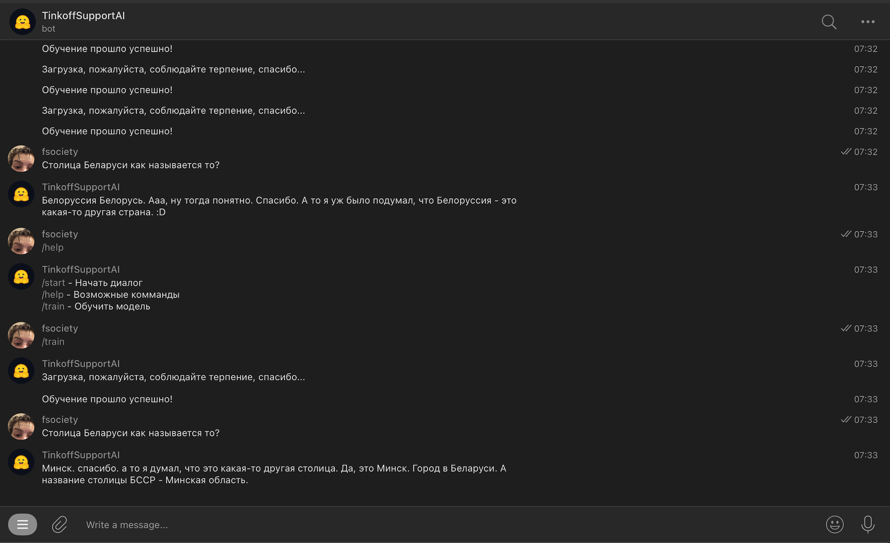

# English

Architecture: [figma](https://www.figma.com/file/YsEBTxV8uMSCKVrR0Dv004/AI_telegram_bot?type=whiteboard&node-id=0-1)

## Table of contents

- [Description](#description)
- [Technologies](#technologies)
- [Structure](#structure)
- [Getting Started](#getting_started)
- [Installation](#installation)

## Description
Telegram bot written on machine learning model from Tinkoff. The purpose of the bot is to compose a pleasant communication with the user. This bot is trained on the Tinkoff model, it also takes the arithmetic mean roughly speaking of the data that more suitable for the user's request from my dataset, which includes the data of correspondence of one chat from telegram, as well as this dataset collects all user requests and responses of the Tinkoff model.

This bot includes 3 commands: /start /help /train. Where /start is the basic command that starts the bot, /help is the command that shows all the commands and /train is the command used to train the model if the answer didn't work for you

## Technologies
- [python-telegram-bot](https://python-telegram-bot.org)
- [torch](https://pytorch.org)
- [transformers](https://huggingface.co/tinkoff-ai/ruDialoGPT-medium?text=%40%40ПЕРВЫЙ%40%40+что+ты+делал+на+выходных%3F+%40%40ВТОРОЙ%40%40)
- [quart](https://pgjones.gitlab.io/quart/)

## Structure
```bash
.
├── tinkoff/
│   ├── tinkoff_bot/
│   │   ├── commands/
│   │   │   └── commands.py
│   │   ├── handlers/
│   │   │   ├── Errors/
│   │   │   │   └── errors.py
│   │   │   └── handlers.py
│   │   ├── security/
│   │   │   ├── token.txt #you should paste your token
│   │   │   └── tokenManager.py
│   │   ├── mainModule.py
│   │   ├── .gitignore
│   │   ├── Dockerfile.development
│   │   └── requirements.txt
│   └── tinkoff_model_service/
│       ├── classifier/
│       │   ├── classifier.py
│       │   └── trainModel.py
│       ├── pipe/
│       │   └── pipeline.py
│       ├── validation/
│       │   ├── requestValidation.py
│       │   └── responseModelValidation.py
│       ├── tools/
│       │   └── collector.py
│       ├── server.py
│       ├── .gitignore
│       ├── Dockerfile.development
│       └── requirements.txt
└── Docker.compose.yaml
```

## Getting Started
- with Python Virtual Environment in both folders:
```bash
python -m venv myenv
```

- activation Windows:
```bash
myenv\Scripts\activate
```

- activation Unix/Linux (Bash/Zsh):
```bash
source myenv/bin/activate
```

- activation Unix/Linux (Fish):
```bash
source myenv/bin/activate.fish
```

- activation Unix/Linux (Csh/Tcsh):
```bash
source myenv/bin/activate.csh
```

- with Conda environment in both folders:
```bash
conda create --name myenv
```
> activation:
conda activate myenv


## Installation

- Local Machine(tinkoff_bot):
```bash
python mainModule.py
```

- Local Machine(tinkoff_model_service):
```bash
python server.py
```

- Local Machine (Docker) in root directory:
```bash
docker login
docker compose up
```


# Russian

Архитектура: [figma](https://www.figma.com/file/YsEBTxV8uMSCKVrR0Dv004/AI_telegram_bot?type=whiteboard&node-id=0-1)

## Таблица контента

- [Описание](#описание)
- [Технологии](#технологии)
- [Структура](#структура)
- [Стартуем!](#стартуем!)
- [Установка](#установка)


## Описание
Телеграмм-бот, написанный на машинном обучении модели от Тинькофф. Цель бота - составить приятное общение с пользователем. Данный бот обучается на модели Тинькофф, также берет среднее арифметическое грубо говоря из данных, которые более подходят под запрос пользователя из моего dataset, который включает в себя данные переписки одного чата из телеграмм, а также этот dataset собирает все запросы пользователей и ответы Тинькофф модели.

Данный бот включает в себя 3 команды: /start /help /train. Где /start - базовая команда, запускающая бота, /help - команда, показывающая все команды и /train - команда, служащая для обучения модели, если ответ вам не подошел

## Технологии
- [python-telegram-bot](https://python-telegram-bot.org)
- [torch](https://pytorch.org)
- [transformers](https://huggingface.co/tinkoff-ai/ruDialoGPT-medium?text=%40%40ПЕРВЫЙ%40%40+что+ты+делал+на+выходных%3F+%40%40ВТОРОЙ%40%40)
- [quart](https://pgjones.gitlab.io/quart/)

## Структура
```bash
.
├── tinkoff/
│   ├── tinkoff_bot/
│   │   ├── commands/
│   │   │   └── commands.py
│   │   ├── handlers/
│   │   │   ├── Errors/
│   │   │   │   └── errors.py
│   │   │   └── handlers.py
│   │   ├── security/
│   │   │   ├── token.txt #вы должны вставить свой токен
│   │   │   └── tokenManager.py
│   │   ├── mainModule.py
│   │   ├── .gitignore
│   │   ├── Dockerfile.development
│   │   └── requirements.txt
│   └── tinkoff_model_service/
│       ├── classifier/
│       │   ├── classifier.py
│       │   └── trainModel.py
│       ├── pipe/
│       │   └── pipeline.py
│       ├── validation/
│       │   ├── requestValidation.py
│       │   └── responseModelValidation.py
│       ├── tools/
│       │   └── collector.py
│       ├── server.py
│       ├── .gitignore
│       ├── Dockerfile.development
│       └── requirements.txt
└── Docker.compose.yaml
```


## Стартуем!
- вместе с Python Virtual Environment в обеих директориях:
```bash
python -m venv myenv
```

- активация Windows:
```bash
myenv\Scripts\activate
```

- активация Unix/Linux (Bash/Zsh):
```bash
source myenv/bin/activate
```

- активация Unix/Linux (Fish):
```bash
source myenv/bin/activate.fish
```

- активация Unix/Linux (Csh/Tcsh):
```bash
source myenv/bin/activate.csh
```

- вместе с Conda environment в обеих директориях:
```bash
conda create --name myenv
```
> активация:
conda activate myenv


## Установка

- Локальная Машина (tinkoff_bot директория):
```bash
python mainModule.py
```

- Локальная Машина (tinkoff_model_service директория):
```bash
python server.py
```

- Локальная Машина (Docker) в корневой директории:
```bash
docker login
docker compose up
```


